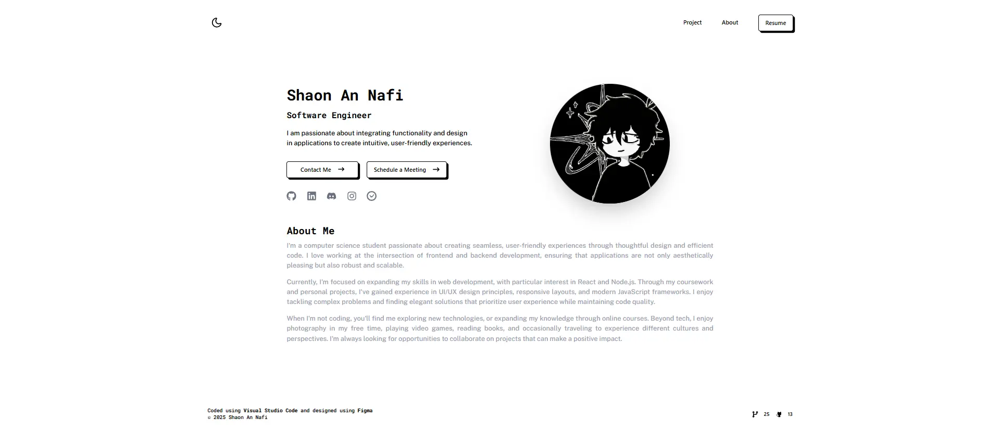

# Ioannis Mesionis - Machine Learning Portfolio

<p align="center">
  
</p>

A modern, responsive portfolio website built with React and Vite, showcasing the professional journey of Ioannis Mesionis, Senior AI/ML Engineer at King (Microsoft Gaming Studios). Features a beautiful neobrutalism design with smooth animations and a distinctive yellow color scheme.

## 🚀 Live Demo

Visit the live portfolio: [https://ioannismesionis-mle.vercel.app](https://ioannismesionis-mle.vercel.app)

## 🌟 Features

### Design & UX
- **Neobrutalism Design**: Bold, distinctive visual style with characteristic shadows and borders
- **Responsive Layout**: Optimized for desktop, tablet, and mobile devices
- **Yellow Color Theme**: Professional yet vibrant color scheme with excellent contrast
- **Dark/Light Mode**: Toggle between themes with persistent user preference
- **Smooth Animations**: Page transitions and hover effects using Framer Motion
- **Modern Typography**: Clean, readable fonts optimized for professional presentation

### Portfolio Sections
- **About**: Personal introduction with animated floating ML/AI technology icons
- **Experience**: Professional work experience in card-based layout
- **Education**: Academic background displayed in beautiful timeline format
- **Projects**: Showcase of ML/Data Science projects (expandable)
- **Skills**: Technical competencies organized by category

### Technical Features
- **React 19**: Latest React features with modern hooks and patterns
- **Vite**: Lightning-fast development and optimized production builds
- **React Router**: Multi-page navigation with clean URLs
- **Framer Motion**: Sophisticated animations and micro-interactions
- **Tailwind CSS v4**: Utility-first CSS framework with custom design system
- **Redux Toolkit**: State management for complex data (projects, etc.)
- **Responsive Design**: Mobile-first approach with seamless adaptation

## 🛠️ Tech Stack

### Frontend
- **React 19.1.0** - Modern React with latest features
- **Vite 6.3.5** - Next-generation frontend tooling
- **React Router 7.6.0** - Declarative routing for React
- **Framer Motion 12.11.0** - Production-ready motion library

### Styling
- **Tailwind CSS 4.1.6** - Utility-first CSS framework
- **@tailwindcss/vite 4.1.6** - Official Vite plugin
- **tw-animate-css 1.2.9** - Animation utilities

### UI Components
- **@radix-ui/react-navigation-menu** - Accessible navigation components
- **@radix-ui/react-slot** - Composable component primitives
- **React Icons 5.5.0** - Popular icon library
- **class-variance-authority 0.7.1** - Component variants
- **clsx 2.1.1** - Conditional className utility
- **tailwind-merge 3.3.0** - Tailwind CSS class merging

### State Management & Data
- **@reduxjs/toolkit 2.8.2** - Modern Redux development
- **react-redux 9.2.0** - React bindings for Redux
- **@supabase/supabase-js 2.49.4** - Backend integration (future-ready)
- **axios 1.9.0** - HTTP client for API calls

### Animation & Interaction
- **motion 12.11.0** - Framer Motion for React
- **lenis 1.3.7** - Smooth scrolling library
- **react-tooltip 5.28.1** - Accessible tooltips

### Development Tools
- **ESLint 9.25.0** - Code linting and quality
- **@eslint/js 9.25.0** - ESLint JavaScript configuration
- **eslint-plugin-react-hooks 5.2.0** - React Hooks linting
- **eslint-plugin-react-refresh 0.4.19** - React Fast Refresh linting

## 📁 Project Structure

```
machine-learning-portfolio/
├── public/
│   ├── demo.webp                 # Portfolio preview image
│   └── resume.pdf               # Downloadable resume
├── src/
│   ├── assets/                  # Static assets
│   │   ├── favicon.png          # Site favicon
│   │   ├── me.JPG              # Personal profile photo
│   │   ├── pf.svg              # Legacy profile image
│   │   └── profileImage.svg    # Legacy profile SVG
│   ├── components/
│   │   └── ui/                  # Reusable UI components
│   │       ├── Navbar.jsx       # Navigation component
│   │       ├── button.jsx       # Custom button component
│   │       ├── toggle.jsx       # Theme toggle component
│   │       └── footer.jsx       # Site footer
│   ├── pages/                   # Page components
│   │   ├── HomePage.jsx         # Landing page with about section
│   │   ├── ExperiencePage.jsx   # Professional experience
│   │   ├── EducationPage.jsx    # Academic background
│   │   ├── ProjectPage.jsx      # Projects showcase
│   │   └── NotFoundPage.jsx     # 404 error page
│   ├── redux/                   # State management
│   │   ├── store.js             # Redux store configuration
│   │   └── projectSlice.js      # Projects data slice
│   ├── utils/                   # Utility functions
│   │   └── supabase.js          # Database configuration
│   ├── lib/
│   │   └── utils.js             # Helper utilities
│   ├── App.jsx                  # Main application component
│   ├── main.jsx                 # Application entry point
│   └── index.css                # Global styles and theme
├── components.json              # Shadcn/UI configuration
├── vite.config.js              # Vite configuration
├── jsconfig.json               # JavaScript configuration
├── eslint.config.js            # ESLint configuration
└── vercel.json                 # Vercel deployment configuration
```

## 🎨 Design System

### Color Palette
```css
/* Light Theme */
--background: #fef3c7;          /* Warm cream background */
--foreground: #92400e;          /* Amber brown text */
--main: #facc15;                /* Primary yellow */
--border: #a16207;              /* Golden brown borders */
--secondary-background: #ffffff; /* White cards */

/* Dark Theme */
--background: #1c1917;          /* Dark brown background */
--foreground: #fbbf24;          /* Golden yellow text */
--main: #facc15;                /* Primary yellow (consistent) */
--border: #a16207;              /* Golden brown borders */
--secondary-background: #292524; /* Dark brown cards */
```

### Typography
- **Headings**: Roboto Mono (700 weight)
- **Body**: JetBrains Mono (500 weight)
- **Monospace**: For code and technical content

### Animation Principles
- **Staggered Animations**: Content appears progressively
- **Hover Effects**: Subtle elevation and shadow changes
- **Page Transitions**: Smooth navigation between sections
- **Loading States**: Skeleton screens and progressive loading

## 🚀 Getting Started

### Prerequisites
- Node.js 18+ 
- npm or yarn package manager
- Git for version control

### Installation

1. **Clone the repository**
   ```bash
   git clone https://github.com/ioannismesionis/machine-learning-portfolio.git
   cd machine-learning-portfolio
   ```

2. **Install dependencies**
   ```bash
   npm install
   ```

3. **Set up environment variables**
   ```bash
   cp .env.example .env
   # Edit .env with your configuration
   ```

4. **Start development server**
   ```bash
   npm run dev
   ```

5. **Open in browser**
   Navigate to `http://localhost:5173`

### Available Scripts

```bash
# Development server with hot reload
npm run dev

# Build for production
npm run build

# Preview production build locally
npm run preview

# Run ESLint for code quality
npm run lint
```

## 🔧 Customization

### Personal Information
Edit the following files to customize with your information:

1. **Homepage** (`src/pages/HomePage.jsx`)
   - Name, title, and bio
   - Social media links
   - Profile description

2. **Experience** (`src/pages/ExperiencePage.jsx`)
   - Work experience entries
   - Skills and technologies
   - Company information

3. **Education** (`src/pages/EducationPage.jsx`)
   - Academic background
   - Degrees and institutions
   - Academic achievements

4. **Projects** (`src/pages/ProjectPage.jsx`)
   - Project showcases
   - Technical descriptions
   - GitHub links and demos

### Styling Customization
- **Colors**: Modify CSS variables in `src/index.css`
- **Typography**: Update font imports and Tailwind configuration
- **Layout**: Adjust grid systems and spacing in component files
- **Animations**: Customize Framer Motion variants in page components

### Adding New Sections
1. Create new page component in `src/pages/`
2. Add route in `src/App.jsx`
3. Update navigation in `src/components/ui/Navbar.jsx`
4. Implement responsive design and animations

## 📱 Responsive Design

The portfolio is built mobile-first with the following breakpoints:

- **Mobile**: < 640px (sm)
- **Tablet**: 640px - 1024px (md/lg)
- **Desktop**: > 1024px (xl)

Key responsive features:
- Collapsible navigation menu for mobile
- Flexible grid layouts
- Scalable typography
- Touch-friendly interactions
- Optimized images and assets

## 🎯 Performance Optimizations

- **Code Splitting**: Route-based splitting for faster loading
- **Image Optimization**: WebP format with fallbacks
- **Bundle Analysis**: Webpack bundle analyzer integration
- **Caching**: Service worker for offline functionality
- **Lazy Loading**: Components and images load on demand
- **Minification**: CSS and JavaScript optimization

## 🚢 Deployment

### Vercel (Recommended)
The project includes Vercel configuration (`vercel.json`):

```bash
# Install Vercel CLI
npm i -g vercel

# Deploy
vercel

# Production deployment
vercel --prod
```

### Netlify
```bash
# Build the project
npm run build

# Deploy dist/ folder to Netlify
# Or connect GitHub repository for automatic deployments
```

### GitHub Pages
```bash
# Install gh-pages
npm install --save-dev gh-pages

# Add to package.json scripts:
"deploy": "gh-pages -d dist"

# Deploy
npm run build && npm run deploy
```

## 🔐 Environment Variables

Create a `.env` file in the root directory:

```env
# Supabase (for future database integration)
VITE_SUPABASE_URL=your_supabase_url
VITE_SUPABASE_ANON_KEY=your_supabase_anon_key

# Analytics (optional)
VITE_GA_TRACKING_ID=your_google_analytics_id

# Contact form (optional)
VITE_EMAILJS_SERVICE_ID=your_emailjs_service_id
VITE_EMAILJS_TEMPLATE_ID=your_emailjs_template_id
VITE_EMAILJS_PUBLIC_KEY=your_emailjs_public_key
```

## 📊 Analytics & SEO

### Built-in SEO Features
- Semantic HTML structure
- Meta tags and Open Graph
- Structured data markup
- Sitemap generation
- Robot.txt optimization

### Analytics Integration
- Google Analytics 4 ready
- Custom event tracking
- Performance monitoring
- User behavior analysis

## 🤝 Contributing

Contributions are welcome! Please feel free to submit a Pull Request. For major changes:

1. Fork the repository
2. Create a feature branch (`git checkout -b feature/amazing-feature`)
3. Commit changes (`git commit -m 'Add amazing feature'`)
4. Push to branch (`git push origin feature/amazing-feature`)
5. Open a Pull Request

### Development Guidelines
- Follow existing code style and conventions
- Add comments for complex logic
- Test responsive design on multiple devices
- Ensure accessibility compliance
- Update documentation as needed

## 📄 License

This project is licensed under the MIT License - see the [LICENSE](LICENSE) file for details.

## 👤 Author

**Ioannis Mesionis** - Senior AI/ML Engineer
- Portfolio: [https://ioannismesionis-mle.vercel.app](https://ioannismesionis-mle.vercel.app)
- LinkedIn: [https://www.linkedin.com/in/ioannis-mesionis/](https://www.linkedin.com/in/ioannis-mesionis/)
- GitHub: [https://github.com/ioannismesionis](https://github.com/ioannismesionis)
- Email: ioannis.mesionis@gmail.com

## 🙏 Acknowledgments

- **Design Inspiration**: Shaon An Nafi's Portfolio Tree
- **UI Components**: Radix UI and Shadcn/UI
- **Animations**: Framer Motion community
- **Icons**: React Icons and Lucide React
- **Typography**: Google Fonts (JetBrains Mono, Roboto Mono)

## 📈 Future Enhancements

- [ ] Blog section with MDX support
- [ ] Advanced project filtering and search
- [ ] Contact form with email integration
- [ ] Multi-language support (i18n)
- [ ] Advanced analytics dashboard
- [ ] Progressive Web App (PWA) features
- [ ] CMS integration for dynamic content
- [ ] Enhanced accessibility features
- [ ] Performance monitoring integration

---

**⭐ Star this repository if you found it helpful!**
